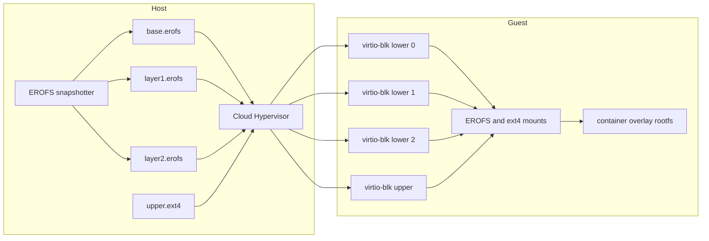
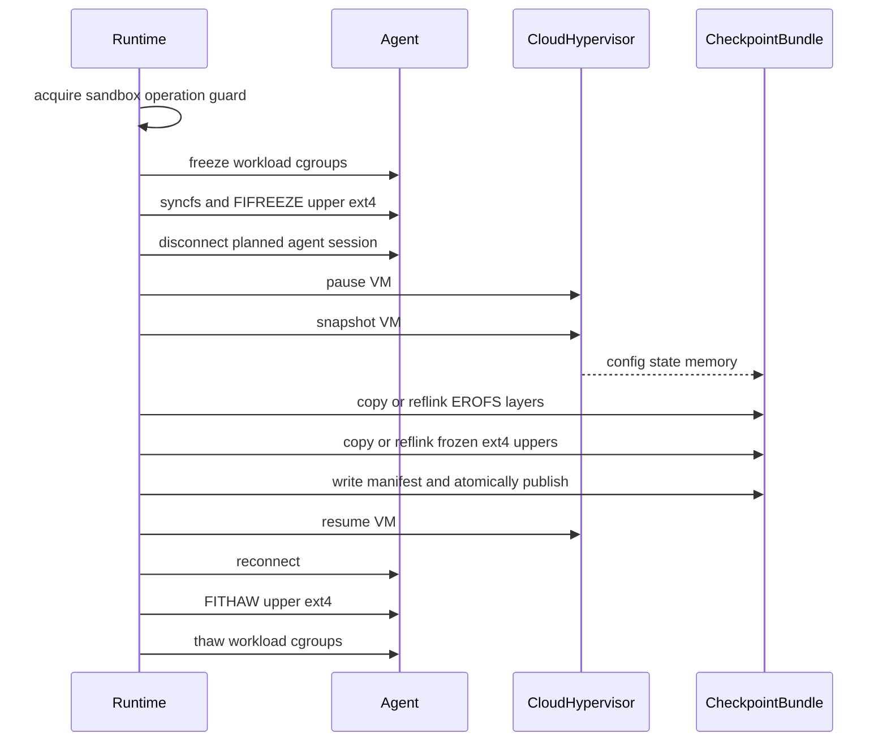

# Cloud Hypervisor checkpoint and restore with EROFS block devices

## Status

The initial implementation is available in runtime-rs. It supports independent
raw EROFS devices on Cloud Hypervisor, archives EROFS and ext4 backing files,
restores writable uppers from private clones, and rewrites saved Cloud
Hypervisor disk paths by disk ID.

For compile, install, and a `crictl` walkthrough, see
[How to build, install, and use Cloud Hypervisor checkpoint and restore](../how-to/how-to-build-and-use-cloud-hypervisor-checkpoint-restore.md).

Basic checkpoint and restore was verified with Cloud Hypervisor v53.0 and
containerd v2.3.3 on September 21, 2026. The verified containerd configuration
emitted one merged EROFS lower plus one ext4 upper for each active snapshot.
The runtime path for multiple independent EROFS mounts is implemented, but that
specific layout still needs an end-to-end snapshotter configuration that emits
unmerged mounts.

The previous Cloud Hypervisor checkpoint and restore implementation uses
virtio-fs and is described in
[Cloud Hypervisor checkpoint and restore debugging](cloud-hypervisor-checkpoint-restore-debugging.md).

!!! warning "Current consistency guarantee"
    The initial implementation pauses the VM before copying the ext4 backing
    files and therefore provides crash-consistent storage. The sandbox-scoped
    guest `syncfs` plus `FIFREEZE` and `FITHAW` protocol in this design remains
    future work; application-consistent checkpoint is not yet claimed.

## Summary

This design removes `virtiofsd` from the container root filesystem
checkpoint and restore path. Each immutable EROFS image layer is exposed to the
guest as an independent read-only raw virtio-blk device. A separate writable
ext4 virtio-blk device provides the overlay upper and work directories.

The source and restored VMs have the same block-device topology. Checkpoint
captures Cloud Hypervisor state and memory, copies the immutable EROFS layers,
and takes a consistent copy of each ext4 writable layer. Restore substitutes
checkpoint-local backing-file paths while preserving disk IDs, PCI topology,
queue settings, and read-only attributes.

The EROFS snapshotter remains responsible for creating EROFS files. Kata
attaches, records, copies, and restores those files, but does not rebuild OCI
layers or run `mkfs.erofs` in the Pod startup or checkpoint path.

## Motivation

Cloud Hypervisor can restore a virtio-fs device, but that requires restoring
more than the VM snapshot:

- a new `virtiofsd` must accept the restored vhost-user connection;
- runtime socket paths embedded in the snapshot must be changed;
- the source virtio-fs inode namespace must be reconstructed under a new
  sandbox;
- the implementation depends on compatible vhost-user feature negotiation.

Raw virtio-blk devices avoid the FUSE inode table, vhost-user connection state,
and source sandbox share paths. Cloud Hypervisor already records virtio-blk
device state and configuration in its snapshot. The remaining storage problem
is to preserve the backing files at the same consistency point as VM memory and
device state.

## Goals

- Restore running container processes and their in-memory state.
- Remove `virtiofsd` from the container rootfs path.
- Preserve rootfs writes in an ext4-backed overlay upper.
- Keep checkpoint bundles reusable by giving every restore a private writable
  upper.
- Support a self-contained same-node checkpoint first.
- Retain the existing sandbox checkpoint API, agent reconnect, sandbox rebind,
  and task adoption flow.

## Non-goals

- Changing the containerd EROFS snapshotter or differ format.
- Building a merged EROFS image inside Kata.
- Replacing virtio-fs for arbitrary `hostPath`, ConfigMap, Secret, or other
  host-file mounts in the first implementation.
- Preserving Pod IP addresses or established network connections.
- Supporting confidential guests, VFIO, GPUs, or additional writable volumes
  in the first implementation.
- Cross-architecture or cross-Cloud-Hypervisor-version restore.

## Required invariant: storage topology cannot change at restore

Cloud Hypervisor restores guest PCI state, virtio queues, and the guest kernel's
mounted filesystems. A VM that used virtio-fs when its checkpoint was created
cannot therefore be restored with an EROFS virtio-blk rootfs. The source VM
must use the block layout from container creation onward.

For each restored disk, the following properties must match the source
snapshot:

- Cloud Hypervisor disk ID and PCI location;
- disk count and ordering;
- virtual capacity;
- read-only flag;
- queue count and queue size;
- backing content for read-only disks.

Host backing-file paths may change. Restore patches those paths before invoking
the Cloud Hypervisor restore API.

## Responsibility boundaries

containerd EROFS snapshotter and differ
:   Convert OCI content into EROFS layers, retain content identity, and own
    normal image caching and garbage collection.

Kata runtime
:   Attach each supplied EROFS file as a read-only raw virtio-blk device,
    attach the ext4 writable layer, preserve device identity, and archive the
    backing files during checkpoint.

kata-agent
:   Mount the EROFS lower devices and ext4 upper device, assemble the overlay,
    and quiesce or thaw writable filesystems for checkpoint and restore.

Cloud Hypervisor
:   Save and restore CPU, memory, PCI, virtio-blk, vsock, and network device
    state.

!!! warning "Kata must not generate OCI EROFS layers"
    Rebuilding layers in Kata would duplicate snapshotter work, bypass its
    content identity and garbage collection, add unbounded startup or
    checkpoint latency, and require Kata to reproduce OCI whiteout semantics.
    When layer-count reduction is necessary, it belongs in the snapshotter or
    differ and should be cached by image chain identity.

## Storage architecture



The agent mounts each EROFS device separately and constructs the lower list in
OCI precedence order:

```text
lowerdir=lower-2:lower-1:lower-0
upperdir=upper/upper
workdir=upper/work
```

This extends the agent's existing multi-layer behavior, but removes the
QEMU-specific VMDK and GPT aggregation. Cloud Hypervisor sees each source EROFS
file as an ordinary raw disk.

### Device-count policy

One virtio-blk device per image layer consumes PCI and virtio queue resources.
The implementation must define a Cloud-Hypervisor-specific maximum that is
validated before VM startup. The initial value should be based on tested PCI
segment and disk limits rather than the runtime's existing generic 128-layer
sanity limit.

If an image exceeds the limit, Kata fails creation with an actionable error.
A future snapshotter-side flattening policy can reduce the layer count; Kata
must not silently merge layers at runtime.

## Checkpoint artifacts

```text
checkpoint/
├── metadata.json
├── config.json
├── state.json
├── memory-ranges
└── containers/
    └── <old-container-id>/
        ├── lower-0.erofs
        ├── lower-1.erofs
        ├── lower-2.erofs
        └── upper.ext4
```

`config.json`, `state.json`, and `memory-ranges` are produced by Cloud
Hypervisor. `metadata.json` is produced by Kata and maps stable device
identities to checkpoint-local files.

An illustrative block disk entry in `metadata.json` is:

```json
{
  "version": 1,
  "containers": [
    {
      "old_id": "container-id",
      "disks": [
        {
          "id": "container-id-lower-0",
          "role": "erofs-lower",
          "path": "containers/container-id/lower-0.erofs",
          "readonly": true,
          "size": 67108864,
          "num_queues": 1,
          "queue_size": 128
        },
        {
          "id": "container-id-upper",
          "role": "ext4-upper",
          "path": "containers/container-id/upper.ext4",
          "readonly": false,
          "size": 1073741824
        }
      ]
    }
  ]
}
```

The current schema records queue settings and the source disk identity needed
to find the corresponding `config.json` entry. Content digests and integrity
metadata required for dm-verity remain future work.

EROFS files are immutable and may be copied with reflink when the backing
filesystem supports it. File type, containment, size, read-only state, and
queue settings are verified before restore. Writable ext4 images are never
used directly from the canonical checkpoint.

## Checkpoint consistency

Pausing the VMM alone does not guarantee that an independently copied ext4
backing file contains all writes represented in guest memory. The runtime must
quiesce each writable filesystem before taking the VM snapshot and copying its
backing file.



The storage quiesce API must be sandbox-scoped and idempotent. It records which
filesystems it successfully froze so that partial failures can thaw only those
filesystems.

Checkpoint is first assembled in a sibling temporary directory. The manifest
is written last, files and the directory are synced as required, and the
temporary directory is atomically renamed to the requested checkpoint path.
An incomplete directory is never considered restorable.

### Source rollback

After the VMM has been paused, every error path attempts the following cleanup
in order:

1. resume the source VM;
2. reconnect the agent;
3. thaw frozen ext4 filesystems;
4. thaw workload cgroups;
5. remove the unpublished temporary checkpoint.

The original operation error remains the primary error, with rollback failures
attached as context.

## Restore

Every restore receives a private upper image:

```text
checkpoint/containers/<old-id>/upper.ext4
    |
    +-- reflink/copy --> restores/<new-sandbox-id>/<old-id>/upper.ext4
```

This prevents a failed restore or later container cleanup from modifying the
canonical checkpoint.

Restore performs these steps:

1. Validate Cloud Hypervisor compatibility, artifact sizes, and complete disk
   topology.
2. Create the restore-private directory and clone every ext4 upper.
3. Copy `config.json` and `state.json` into the new sandbox runtime directory.
4. Match `config.json` disk entries by stable Cloud Hypervisor disk ID and
   replace their backing paths with checkpoint EROFS paths or private ext4
   paths.
5. Verify that read-only flags, capacity, queue settings, and disk count still
   match the manifest.
6. Patch the vsock path and provide the destination TAP file descriptors, as in
   the existing Cloud Hypervisor restore implementation.
7. Restore with on-demand memory and resume the VM.
8. Reconnect kata-agent and thaw the ext4 filesystems captured in the frozen
   state.
9. Rebind the restored sandbox and container IDs.
10. Adopt restored tasks when containerd sends `CreateContainer` and
    `StartContainer`; do not attach duplicate rootfs disks or start new guest
    processes.

!!! important "Match disks by ID"
    Restore must not match disks by array index, host path, or `/dev/vdX`
    name. Those values may change independently of the identity recorded in
    Cloud Hypervisor device state.

Although Cloud Hypervisor reconstructs the devices, runtime-rs must also
rehydrate its device-manager bookkeeping. This is required for later cleanup
and prevents the destination `CreateContainer` path from hot-plugging a second
set of rootfs disks.

## Interaction with non-rootfs mounts

Setting `shared_fs = "none"` is valid only when all required container
filesystems have a non-virtio-fs transport. EROFS block rootfs support does not
automatically provide:

- host bind mounts;
- Kubernetes projected ConfigMaps or Secrets;
- `hostPath` volumes;
- arbitrary host files injected into the container.

The first implementation either rejects such mounts with a clear error or
retains virtio-fs for those mounts. Fully eliminating `virtiofsd` requires a
separate design for guest-side file injection and volume transport.

## Security and integrity

- Content digests should be added to detect same-size checkpoint corruption.
- Existing per-layer dm-verity metadata should remain associated with the
  corresponding layer and be reconstructed before the guest mount.
- Checkpoint and restore paths must reject symlinks and path traversal outside
  the approved checkpoint root.
- Artifact files are opened without following untrusted links where possible.
- The checkpoint directory remains immutable while any restored VM uses its
  EROFS files or on-demand memory file.
- Confidential guest restore remains unsupported until the VMM and platform
  provide an attested snapshot and restore model.

## Implementation outline

Runtime EROFS rootfs
:   Add a Cloud Hypervisor path that creates one `BlockConfigModern` per EROFS
    source and never generates a VMDK or GPT wrapper. Preserve ordered layer
    metadata and enforce the backend-specific device limit.

Agent multi-layer storage
:   Accept independent EROFS block devices as overlay lowers, preserve OCI
    precedence. Idempotent ext4 quiesce and thaw operations remain follow-up
    work.

Checkpoint metadata
:   Replace virtio-fs overlay `rw-diff` export with a versioned block-device
    manifest and immutable artifact export.

Cloud Hypervisor restore
:   Extend checkpoint path patching to rewrite disk backing paths by disk ID
    and validate all topology-affecting fields.

Sandbox and container restore
:   Skip virtio-fs reconstruction, rebind old IDs to new CRI IDs, and adopt
    tasks without adding rootfs devices again. Cloud Hypervisor restores the
    saved devices; explicit device-manager rehydration is still needed before
    supporting independent container rootfs removal from a restored sandbox.

## Implementation and verification pitfalls

### The snapshotter output is the source of truth

The first design assumed that the EROFS snapshotter would expose every OCI
layer as an independent mount. The containerd v2.3.3 environment used for
verification instead emitted one merged EROFS lower and one ext4 upper. An
attempt to configure a `max_unmerged_layers` option did not change that output
because that option is not supported by the installed plugin.

The runtime therefore accepts every EROFS mount that containerd supplies
without trying to recreate or split layers. The independent-device path is
implemented, while verification of multiple unmerged lowers still requires a
snapshotter configuration that actually emits them.

### Structured VMDK is a QEMU-specific transport

The pre-existing multi-layer path assembled GPT and VMDK metadata. Passing
that structure to Cloud Hypervisor was unsafe because its conversion code only
consumed the raw backing path and could silently ignore the structured VMDK
description.

The hypervisor interface now advertises structured VMDK support explicitly.
QEMU retains that path, while Cloud Hypervisor rejects structured VMDK and
receives one raw `BlockConfigModern` per EROFS source.

### Restore identity must use disk IDs

Source backing paths become invalid after the source sandbox is removed, array
positions are not a stable identity, and guest `/dev/vdX` names are not
available while patching the VMM configuration. The checkpoint must propagate
the runtime device ID into Cloud Hypervisor's `DiskConfig`, archive that ID,
and match `config.json` entries by ID during restore.

Shared EROFS lowers can appear in metadata for more than one container. They
must be archived once and deduplicated by ID. Conflicting metadata for the same
ID is an error, and every non-boot disk in the saved VMM configuration must be
represented in checkpoint metadata.

### Writable uppers cannot run from the canonical checkpoint

Using the archived ext4 image directly would mutate the checkpoint and make a
second restore dependent on the first. Restore now creates a reflink or copy of
each writable upper in the destination VM directory. Read-only EROFS files may
be used from the checkpoint after containment and topology validation.

Checkpoint-relative paths require security checks in addition to rejecting
`..` components. Restore rejects symbolic links and non-regular files,
canonicalizes both the checkpoint root and each disk, and verifies that every
resolved source remains below the checkpoint root.

### Backend-specific artifacts must remain backend-specific

Cloud Hypervisor writes `config.json`, but the QEMU checkpoint format does
not. Reading that file unconditionally introduced a QEMU regression after the
block-rootfs implementation was added. The runtime now loads and patches
`config.json` only when the backend uses raw EROFS disks; QEMU EROFS continues
through its structured VMDK and virtio-fs checkpoint path. A sandbox mixing
block and virtio-fs rootfs containers is rejected during preflight, before the
VM is paused or partial checkpoint artifacts are created.

### Local verification had configuration traps

- Quoted containerd plugin names must include the closing quote. The invalid
  header `[plugins.'io.containerd.differ.v1.erofs]` caused `toml: literal
  strings cannot have new lines`; the valid header ends with `erofs']`.
- Building from `src/runtime-rs` still places workspace binaries under the
  repository-level `target/release`, not `src/runtime-rs/target/release`.
- Inspecting both filesystems and disks requires constructing the result
  object before iterating:
  `jq '{fs, disks: [.disks[] | {id, path, readonly}]}' config.json`.
- A restored VM's runtime directory name must not be inferred from the CRI Pod
  ID. Sandbox ID rebinding can make those values differ; inspect runtime
  metadata instead.
- Reusing the same CRI sandbox name before the previous sandbox is fully
  removed leaves the name reserved in containerd. Use unique test identities
  or force-remove the previous sandbox before a repeated restore.
- A source counter may advance after checkpoint because the source VM resumes.
  The restored counter is expected to resume from checkpoint time, not from
  the source's later value. Continuity should be checked within each restored
  workload.

!!! warning "Remaining initial implementation limitations"
    Ext4 checkpoint files are crash-consistent, not application-consistent.
    Same-size content corruption is not yet detected. Device-manager
    bookkeeping is not rehydrated, so independent container rootfs hot-unplug
    from a restored sandbox is not supported; normal sandbox teardown remains
    the supported cleanup path.

## Verification

The first end-to-end test uses one workload container that continuously updates
both an in-memory counter and a file in its rootfs. It verifies:

1. no `virtiofsd` process or Cloud Hypervisor `fs` device is used for rootfs;
2. each EROFS layer appears as a read-only raw virtio-blk device;
3. the writable ext4 upper appears as a separate virtio-blk device;
4. checkpoint resumes the source before returning;
5. source sandbox removal does not invalidate the checkpoint;
6. restore uses a private copy of the ext4 upper;
7. the in-memory counter continues rather than restarting;
8. the rootfs file contains all writes made before checkpoint;
9. a second restore from the same checkpoint succeeds independently; and
10. missing, reordered, resized, or modified disk artifacts fail before VM
    resume.

Stress coverage should add repeated checkpoint and restore cycles, multiple
containers, high write rates, ext4 journal activity, the maximum supported
EROFS layer count, and injected failures at every quiesce and rollback stage.

The initial end-to-end run completed the following basic sequence:

- started a block-only Cloud Hypervisor sandbox with no `fs` device;
- advanced `/counter` from `33` to `35` after checkpoint, proving source
  resume;
- removed the source sandbox and restored from checkpoint;
- adopted the restored workload and observed `/counter` advance from `31` to
  `33`;
- removed that destination and restored the same checkpoint again; and
- observed the second destination advance from `26` to `28`.

Each destination used private ext4 files under its VM runtime directory while
the EROFS lower remained read-only in the checkpoint bundle.

After the final path-validation and shared-disk deduplication changes, a
regression run restored the same checkpoint into two distinct sandboxes. Both
workloads resumed at counter `8` and advanced to `10`. The archived metadata
contained one shared read-only EROFS lower ID and separate writable ext4 upper
IDs.
