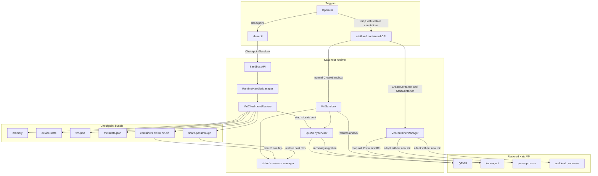
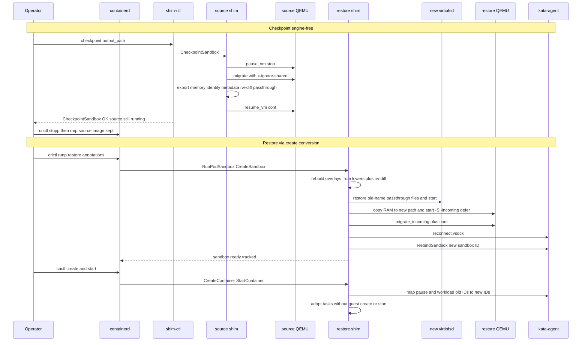

# QEMU Pod checkpoint and restore (verification design)

This document records how to verify QEMU-level checkpoint and restore for a
**running** sandbox by **filling in the community Pod-level C/R scaffold**
(kata-containers/kata-containers#13654) with the actual hypervisor work. The goal is
to prove the hypervisor and runtime can capture and resume guest execution state
without waiting for a patched containerd or Kubernetes KEP-5823.

The design deliberately **does not invent a private Kata protocol**. It reuses the
`SandboxCheckpointRestore` / `ContainerCheckpointRestore` traits, `RebindSandbox`,
and the agent-reconnect plumbing that #13654 already lands on the runtime-rs side.
The only thing missing there is the VMM dump/restore body (marked
`// TODO: do real work here`). This verification fills that body for QEMU.

Triggering is split so containerd still owns the restored pod:

- **Checkpoint** is engine-free: an extended `shim-ctl` sends `CheckpointSandbox` to
  the running shim's Sandbox-API socket.
- **Restore** is a **create conversion**: a normal `RunPodSandbox` / `crictl runp`
  of a new pod with restore annotations. Kata turns that create into incoming QEMU +
  `RebindSandbox` + task adopt. The Sandbox-API `RestoreSandbox` RPC stays
  scaffolded but **not wired** for this verification.

!!! warning "Status"
    This is a verification design. The community scaffold (#13654) plumbs the traits,
    types and ttrpc but leaves dump/restore as TODO; the QEMU body is **not**
    implemented on `main`. Do not treat VM templating or guest CRIU prototypes as a
    substitute for the acceptance checks in this document.

## Why not KEP-5823 first

KEP-5823 adds CRI `CheckpointPod` and `RestorePod` (Kubernetes 1.37 Alpha). The
intended split is:

kubelet
:   Kubernetes validation, checkpoint directory, deadline, `StartContainer` after restore.

containerd
:   CRI lock, CNI, NRI, new IDs, task adoption, publish, rollback.

sandbox runtime (Kata)
:   Opaque Pod/VM execution state.

Independent per-container CRIU dumps cannot freeze a consistent Kata VM. Delegating
the whole operation to the runtime would skip CNI/NRI/rollback. Interpreting the
checkpoint format inside containerd would couple CRI to one VMM.

Kata tracking:

- kata-containers/kata-containers#13653 (feature: runtime-rs Pod-level C/R)
- kata-containers/kata-containers#13654 (branch `pod-level-ckpt-shim-only`: the
  runtime-rs scaffold this design builds on — traits, Sandbox-API `CheckpointSandbox`
  / `RestoreSandbox`, `RebindSandbox`, agent reconnect; dump/restore still TODO)
- containerd/containerd#13970 (closed as duplicate of #13979)

Until containerd routes `CheckpointPod` to the shim sandboxer, kubelet calls return
`Unimplemented`. Go shim `Checkpoint()` on `main` is `ErrNotImplemented`. Rather than
invent a parallel protocol, this design **implements the #13654 traits for QEMU**.
Checkpoint is driven engine-free over the shim's Sandbox-API socket. Restore is
driven by converting a normal containerd create so the engine **tracks** the restored
sandbox. Later, a patched containerd can swap the restore trigger to
`RestoreSandbox` without rewriting the QEMU / agent internals.

## Community scaffold this builds on (#13654)

The `pod-level-ckpt-shim-only` branch already lands the runtime-rs plumbing. Treat it
as the contract; this design fills the VMM body, adds an engine-free checkpoint
client, and drives restore through create conversion rather than the `RestoreSandbox`
RPC.

Traits (`src/runtime-rs/crates/runtimes/common/src/checkpoint_restore.rs`)
:   `SandboxCheckpointRestore` — `validate_checkpoint_sandbox`, `checkpoint_sandbox`,
    `restore_sandbox`, `prepare_restore_sandbox`, `complete_restore_sandbox`,
    `cleanup_sandbox_checkpoint`. `ContainerCheckpointRestore` —
    `prepare_checkpoint_tasks`, `pause_checkpoint_tasks`, `resume_checkpoint_tasks`,
    `restore_tasks`. Both are bundled in `CheckpointRestoreRuntime { sandbox,
    container_manager }` and hung off `RuntimeInstance.checkpoint_restore:
    Option<CheckpointRestoreRuntime>`.

Sandbox-API messages
:   `SandboxRequest` / `SandboxResponse` gain `CheckpointSandbox(CheckpointSandboxRequest)`
    and `RestoreSandbox(Box<RestoreSandboxRequest>)`. `sandbox_service.rs` exposes the
    `checkpoint_sandbox` / `restore_sandbox` ttrpc methods (via a forked
    `containerd-shim-protos` that carries the sandbox_api extensions), and the Task
    service is registered as `containerd.task.v3.Task`.

Two-phase restore (community RPC; not used as the verification trigger)
:   Option key `io.containerd.pod-restore.phase` with values `prepare` / `complete`
    (`RESTORE_PHASE_OPTION` / `_PREPARE` / `_COMPLETE`). On the #13654 branch,
    `prepare` initializes the runtime instance and brings QEMU up incoming;
    `complete` reuses it to rebind and adopt tasks. This verification calls the
    **same** `prepare_restore_sandbox` / `complete_restore_sandbox` methods from
    `VirtSandbox::start` after a restore-annotated create, and does **not** expose
    that split as a ttrpc `RestoreSandbox` call.

Transaction safety
:   `RuntimeHandlerManager` holds a `sandbox_operation_guard` RwLock — checkpoint /
    restore take the **write** (exclusive) lock, normal task/sandbox ops take a
    **read** lock, pure observers (Platform / Wait / Status / Ping) skip it. The
    ttrpc handler `tokio::spawn`s the operation so a transport-deadline drop cannot
    abort the resume/rollback path; `operation_timeout` is derived from the ttrpc ctx
    minus a cleanup margin (`sandbox_operation_timeout`). A failed restore calls
    `sandbox.shutdown()` to roll back. Errors map to ttrpc codes via the
    `InvalidSandboxOperation` / `SandboxOperationPrecondition` /
    `SandboxOperationUnsupported` / `SandboxOperationDeadline` variants.

Agent side
:   `agent.proto` adds `rpc RebindSandbox(RebindSandboxRequest)` with
    `ContainerIDMapping { old_id, new_id, hosts_file, process, linux_resources }`,
    plus `sandbox_id`, `hostname`, `dns`. The runtime-rs agent client gains reconnect
    state (`reconnecting`, `reconnect_generation`, `reconnected` `Notify`):
    `disconnect()` shuts down the vsock socket so a long-running `WaitProcess` returns
    before the snapshot and retries after the planned reconnect. `reseed_random_dev`
    and `set_guest_date_time` are wired for post-restore fixups.

!!! note "Where QEMU work goes"
    Fill `SandboxRequest::CheckpointSandbox` in `manager.rs` (the first
    `// TODO: do real work here`) and the `SandboxCheckpointRestore` /
    `ContainerCheckpointRestore` trait bodies. Restore work goes in
    `VirtSandbox::start` (create conversion), not the `RestoreSandbox` ttrpc arm.

## What QEMU already has (and what it is not)

runtime-rs QEMU already exposes:

- `pause_vm` → QMP `stop`
- `resume_vm` → QMP `cont`
- `save_vm` → `migrate exec:cat > device_state_path`
- `boot_from_template` → `-incoming defer` then `migrate_incoming exec:cat <state>` then `cont`

That plumbing is used today for **VM templating**: file-backed memory plus a device
state file, taken after the agent answers and **before** guest `CreateSandbox`.
Templating speeds cold start. It does **not** snapshot a workload that is already
running.

!!! danger "Do not reuse templating as running restore"
    Template restore still runs guest `CreateSandbox` / `CreateContainer` because the
    guest is empty. A running checkpoint already has a sandbox and processes in the
    guest. Calling create again conflicts or resets the tree. Also
    `wait_for_migration` is currently ~280ms; even with memory scheme (a) below (RAM
    stays in a file, out of the migrate stream) the device-state dump of a busy guest
    can exceed that. Make the timeout configurable for checkpoint / restore.

Related but out of scope for this verification:

VM templating
:   See [What Is VM Templating](../how-to/what-is-vm-templating-and-how-do-I-use-it.md).

Guest CRIU
:   Process-tree dump inside the VM (for example the `criu-cr-containerd` prototype).
    Container-level, not a consistent QEMU VM snapshot.

Firecracker snapshot
:   kata-containers/kata-containers#13754. Same *problem* (running sandbox), different VMM.

## Design constraints

- Change **Kata only**. containerd, kubelet, and CRI stay unmodified.
- Checkpoint goes through the #13654 `CheckpointSandbox` Sandbox-API method (shim-ctl
  client). Restore goes through a **normal create** that Kata converts internally,
  calling the same `prepare_restore_sandbox` / `complete_restore_sandbox` /
  `restore_tasks` trait methods. Do not invent a second dump/restore engine.
- Checkpoint artifacts stay **opaque** files on the host (reuse template layout).
- Guest rootfs starts with the **original OCI image over virtio-fs** (the default
  Kata `shared_fs`), because that is the realistic path. The known risk is `virtiofsd`
  / fuse-session reconnect on restore (see the restore steps). If that cannot be made
  reliable, fall back to a **read-only block/erofs image over virtio-blk**, which
  re-attaches to the restored QEMU cleanly. With virtio-fs the guest RAM is already
  file-backed (`add_virtiofs_share` installs a `memory-backend-file`), so memory
  scheme (a) fits without extra work.
- First verification is **same node**, new CNI identity, no GPU/VFIO, no extra volumes.
- Preserve in-guest process memory. Do **not** require preserved Pod IP or live TCP.

## Implemented architecture

The implementation keeps the community Sandbox-API and checkpoint/restore traits as
the control-plane contract. It adds the QEMU, storage reconstruction, guest rebind,
and task-adoption data planes around that contract:



The checkpoint side bypasses containerd only as a temporary trigger. The restore side
uses a normal CRI create, so containerd owns and tracks the new sandbox and tasks.
The guest processes are not recreated: QEMU restores them, kata-agent renames their
sandbox and container identities, and the new shim adopts them.

## Driving the operation

Checkpoint and restore hit the **same** `SandboxCheckpointRestore` /
`ContainerCheckpointRestore` traits. The transports differ so containerd can track
the restored sandbox.

Checkpoint — engine-free (this verification)
:   Extend `shim-ctl` into a ttrpc client that connects to the running shim's
    Sandbox-API socket and sends `CheckpointSandboxRequest`. containerd is not in the
    routing path.

Restore — create conversion (this verification)
:   A normal `crictl runp` / `RunPodSandbox` of a **new** pod with restore
    annotations. containerd creates and tracks the sandbox as usual. Kata's
    `CreateSandbox` / `VirtSandbox::start` path sees the annotation and converts the
    create into incoming QEMU + agent reconnect + `RebindSandbox`. Follow-on
    `CreateContainer` / `StartContainer` become adopt (new CRI ids, guest processes
    already running).

Sandbox-API `RestoreSandbox` RPC (future)
:   A patched containerd can later route `RestorePod` to the shim's
    `restore_sandbox` method. Out of scope here; leave the #13654 ttrpc arm unwired.

### Checkpoint — implementing `checkpoint_sandbox`

`SandboxRequest::CheckpointSandbox` (the first `// TODO`) runs, under the write guard:

1. `ContainerCheckpointRestore::prepare_checkpoint_tasks` — record each task's
   image identity, overlay snapshot (lower dirs + upper/diff), virtio-fs share layout
   (`passthrough` relative paths), and OCI config. In the virtio-blk fallback, also
   record `rootfs_device_id`.
2. `pause_checkpoint_tasks` → `QemuInner::pause_vm` (QMP `stop`) so RAM and the
   writable layer are consistent.
3. `SandboxCheckpointRestore::checkpoint_sandbox` → `save_vm` into
   `CheckpointSandboxRequest.output_path` using memory scheme (a) **and** copy the
   checkpoint bundle below (metadata, configs, rw diffs) while the VM is still paused.
4. `resume_checkpoint_tasks` → `resume_vm` (QMP `cont`) so the KEP contract "resume
   before return" holds. The operator then `crictl stopp` + `rmp` (see below).

Do **not** rely on the live share tree
(`/run/kata-containers/shared/sandboxes/<sid>/{rw,ro}`). Source stop/cleanup
removes it (`VirtiofsShareMount::cleanup`). Everything restore needs must already be
in `checkpoint_dir`.

Artifact layout (memory scheme **a** plus exported sandbox/container state):

```text
checkpoint_dir/
├── memory                         # private file-backed guest RAM
├── device-state                   # CPU and device migration stream
├── vm.json                        # source vsock CID and guest NIC MACs
├── metadata.json                  # old IDs, OCI specs and overlay paths
├── share-passthrough/             # hostname, hosts and resolv.conf files
│   ├── sandbox-*-hostname
│   ├── sandbox-*-hosts
│   └── sandbox-*-resolv.conf
└── containers/
    └── <old-container-id>/
        ├── rw-diff/                # copied overlay upperdir
        ├── rw-work/                # created empty for restored overlay
        └── merged/                 # restored overlay mount point
```

Memory scheme (a), chosen for this verification:

- Back guest RAM with `memory-backend-file,share=on` on a **per-sandbox private**
  path (`checkpoint_dir/memory`), not the shared template RAM file.
- **Keep** the `x-ignore-shared` migration capability. It makes QEMU skip the
  file-backed RAM in the migrate stream *because that RAM is already persisted in the
  private memory file*. The device-state stream then carries only CPU / device state
  and stays small.
- Map an immutable read-only NVDIMM guest image with `share=on,readonly=on` as
  well. Otherwise QEMU treats it as a migratable RAMBlock and incoming attempts
  to write image bytes into a read-only mapping. QEMU 10.2.1 crashes in `memcpy`
  instead of returning a clean migration error in this case.

!!! warning "\"private\" means a per-sandbox RAM file, not `x-ignore-shared` off"
    Turning `x-ignore-shared` off while RAM is file-backed would write RAM **twice**
    (into both the file and the stream). Keeping the capability **on** with a
    per-sandbox private file is the efficient, correct combination. The only thing
    that must differ from templating is the file path (private, not the shared
    template RAM file).

Pause before migrate **and** before copying `rw-diff/`. The checkpoint RPC then
**resumes** the source (KEP: resume before return). Releasing the source is a
**follow-up CRI sequence**, not part of `CheckpointSandbox`.

### Source teardown after checkpoint: `stopp` then `rmp`

`crictl stopp` (`StopPodSandbox` → Kata `Sandbox.stop`)
:   Kills QEMU (`stop_vm`). That is what frees `checkpoint_dir/memory` so the
    restore VM can map it. It does **not** run `resource_manager.cleanup()`, so the
    virtio-fs share dir may still be present. containerd still tracks the sandbox
    and keeps the **container snapshot** (upper) and **image snapshots** (lowers).

`crictl rmp` (`RemovePodSandbox` → Kata `Sandbox.shutdown` → `cleanup`)
:   Tears down virtiofsd, deletes
    `/run/kata-containers/shared/sandboxes/<sid>`, and drops the **active**
    container snapshot (the live upper). Image layer snapshots that we recorded as
    `lowerdir` stay as long as the **image** remains in containerd.

Verification sequence
:   After `shim-ctl` checkpoint returns: `crictl stopp`, then `crictl rmp`, then
    `crictl runp` for the restore pod. Do **not** `crictl rmi` or snapshot GC in
    between. `rmp` is required so restore is a clean new sandbox (CNI, shim, share
    dir, containerd metadata) and nothing still maps the memory file.

Why not `stopp` only
:   The source pod would still be in containerd (IP, shim, leftover share). Restore
    create-conversion needs a **new** tracked sandbox. A later `rmp` of the source
    during restore would race cleanup.

When image layers are still there
:   Overlay **lower** dirs are image snapshots. They survive `rmp`. They disappear
    only if the image is removed or snapshot GC runs. Overlay **upper** of the
    source does **not** survive `rmp` — that is why `rw-diff/` is copied at
    checkpoint. Restore must never depend on the source active snapshot.

### Host overlay mount (no snapshotter API)

Kata **does not** call the containerd snapshots gRPC (`Prepare` / `View` / `Mounts`).
runtime-rs already only sees what the shim task API passes (`CreateContainer`
`rootfs_mounts` and `spec.root.path`). Adding a snapshotter client would couple
verification to containerd internals and still would not help at **sandbox** start:
`RunPodSandbox` happens before `CreateContainer`, so virtiofsd must come up from
data already in `checkpoint_dir`.

How lower dirs are obtained
:   At checkpoint, parse the **source** overlay options (`lowerdir=`). If
    `rootfs_mounts` is empty (common virtio-fs path: containerd already mounted
    overlay at the bundle rootfs and Kata bind-mounts that path), parse the host
    mount table for that path. Store the lower dir list in `metadata.json`. Those
    paths are immutable image snapshot directories; they remain as long as the
    image is not garbage-collected. Restore uses **that recorded list**, not a
    snapshotter call and not the restore pod's new empty upper.

How upper and work dirs are placed
:   Overlay requires `upperdir` and `workdir` on the **same filesystem**, and
    `upperdir` must not itself be overlay. Both live under the checkpoint dir
    (must be a real fs such as ext4/xfs):

    - `upperdir` = `checkpoint_dir/containers/<old_cid>/rw-diff` (copied at
      checkpoint, while paused)
    - `workdir` = `checkpoint_dir/containers/<old_cid>/rw-work` (created empty at
      restore, not part of the saved blob)
    - mount point = `checkpoint_dir/containers/<old_cid>/merged`

    Then `bind` `merged/` into the new sandbox share at the recorded
    `passthrough` relative path, and start `virtiofsd` on the new sid `ro` dir.
    Do **not** reuse containerd's `workdir`/`upperdir` from the restore
    container snapshot.

Prerequisite
:   Restore is same-node. The image must still be present so recorded lower
    snapshot dirs exist. If a lower path is missing, fail restore (pull/keep the
    image); do not invent a snapshotter `View`.

### Restore — convert create, reuse #13654 internals

On sandbox create, these annotations (names are placeholders; keep them Kata-private)
select the restore path:

```text
io.katacontainers.vm.restore = "true"
io.katacontainers.vm.checkpoint_dir = "/var/lib/kata/ckpt/<id>"
```

`CreateSandbox` / `VirtSandbox::start` then calls `prepare_restore_sandbox` then
`complete_restore_sandbox` on the same new runtime instance (containerd already
started the shim for this sandbox id). Do **not** send a `RestoreSandbox` ttrpc.

**Incoming VM** (`prepare_restore_sandbox`):

1. Rebuild the **host virtio-fs tree for the new sandbox id** from the checkpoint
   bundle (recorded lower dirs + `rw-diff`) **before** QEMU `cont`, then start
   `virtiofsd` on that tree. Do not reuse the source share directory. Do not wait
   for `CreateContainer` (too late for the guest fuse session).
    1. `mkdir` `rw-work/` and `merged/` next to `rw-diff/` (same filesystem).
    2. Mount overlay: `lowerdir=<metadata.json list>`, `upperdir=.../rw-diff`,
       `workdir=.../rw-work` on `.../merged`.
    3. Bind `merged/` into the new sandbox share at the recorded `passthrough`
       paths (`share_to_guest` / `PASSTHROUGH_FS_DIR`).
    4. Start `virtiofsd` on `.../shared/sandboxes/<new_sid>/ro`.
    5. In the virtio-blk fallback, skip this overlay rebuild and re-declare the
       block device with the same node / device ids instead.
2. Start QEMU with the **same machine / device shape** as the source, with
   `-S -incoming defer` and the private `checkpoint_dir/memory` file
   (`memory-backend-file` + `x-ignore-shared`, as in scheme (a)). Attach the
   reconstructed virtio-fs device so the guest fuse session (in restored RAM) talks
   to the new `virtiofsd`. Restore `share-passthrough/` under its old file names
   before incoming: virtiofsd's migrated inode table refers to names such as
   `sandbox-<suffix>-resolv.conf`.
3. `migrate_incoming` from `checkpoint_dir/device-state`, then `cont`.
4. **Do not** send guest `CreateSandbox` or `CreateContainer` — the guest sandbox and
   process tree already exist in the restored RAM.
5. Reconnect the agent vsock (the client's planned-reconnect path); the running
   kata-agent is still listening inside the guest.

**Rebind and adopt** (`complete_restore_sandbox`, then engine `CreateContainer` /
`StartContainer`):

6. `RebindSandbox(RebindSandboxRequest)` with the new `sandbox_id`, `hostname`,
   `dns`, and per-container `ContainerIDMapping { old_id, new_id, hosts_file,
   process, linux_resources }`. Old ids and process/linux blobs come from
   `checkpoint_dir`; new ids are the ones containerd assigned on this create.
7. `CreateContainer` / `StartContainer` become **adopt**: register host-side tasks
   against the already-running guest processes. Do **not** exec a new init. Do **not**
   bind-mount the restore pod's empty snapshot upper over the reconstructed overlay.

On any failure, shut the restored VM down so containerd can fail the create.



## Runtime-rs insertion points

The #13654 branch supplies the first group (contract); this verification adds the
second (QEMU body) and third (driver).

### Increment over #13654

| Area | Community PR #13654 | Added by this implementation |
| --- | --- | --- |
| Checkpoint contract | Traits, Sandbox-API method and orchestration; VMM body is TODO | Running-QEMU `stop` → migrate → bundle export → `cont` |
| Restore contract | Two-phase `RestoreSandbox` RPC scaffold | Restore-annotated normal `RunPodSandbox` create conversion |
| QEMU restore | No running-workload restore | `-S -incoming defer`, private RAM copy, incoming migration and `cont` |
| Memory correctness | No QEMU RAM implementation | Per-sandbox file-backed RAM with `x-ignore-shared` |
| NVDIMM correctness | Not handled | Read-only guest image uses `share=on,readonly=on` so migration skips its RAMBlock |
| VM identity | Not persisted | Save and restore the vsock CID and guest NIC MACs in `vm.json` |
| Root filesystem | No restored writable state | Export overlay `rw-diff`; rebuild lower/upper/work/merged and new virtiofsd |
| Host-backed files | Not handled | Export and restore old-name hostname, hosts and `resolv.conf` passthrough files |
| Guest rebind | Protocol and client plumbing; guest handler is TODO | kata-agent updates sandbox and container IDs in place |
| Task handling | Restore task abstraction | Match pause and workload containers by CRI type/name and adopt without guest create/start |
| Checkpoint driver | No standalone client | `shim-ctl` Sandbox-API `CheckpointSandbox` client |
| CRI integration | Requires a future restore caller | Pass Kata pod annotations and let containerd track the restored sandbox normally |
| Verification | Scaffold only | End-to-end stateful workload checkpoint, source removal, restore and multi-container adoption |

The `RestoreSandbox` RPC remains scaffolded and unwired. A future containerd
implementation can replace the create-conversion trigger while reusing the QEMU,
bundle, rebind, and adoption internals.

### Provided by #13654 (fill the bodies)

`src/runtime-rs/crates/runtimes/common/src/checkpoint_restore.rs`
:   Implement the `SandboxCheckpointRestore` / `ContainerCheckpointRestore` traits for
    the QEMU virt-container runtime (today they are trait definitions only).

`src/runtime-rs/crates/runtimes/src/manager.rs`
:   Replace the `CheckpointSandbox` `// TODO: do real work here` with calls into the
    trait implementations. Keep the write-guard, spawn, timeout, and rollback. Leave
    the `RestoreSandbox` ttrpc arm unused (create conversion does not use it).

`src/runtime-rs/crates/agent/src/kata/{mod,agent,trans}.rs`, `agent.proto`
:   `RebindSandbox` / `ContainerIDMapping` and the reconnect state already exist on the
    branch; the guest-side `RebindSandbox` handler in kata-agent is still to be added.

### Added by this verification

`src/runtime-rs/crates/hypervisor/src/qemu/inner.rs`
:   Wire `pause_vm`, `resume_vm`, `save_vm`, `boot_from_template`,
    `wait_for_migration` into the trait implementations. Make the migrate wait timeout
    configurable for running dumps (280ms hardcoded today). `save_vm` sets
    `x-ignore-shared` only under `boot_to_be_template`; for scheme (a) it must set the
    capability for a checkpoint too.

`src/runtime-rs/crates/hypervisor/src/qemu/cmdline_generator.rs`
:   With virtio-fs, `add_virtiofs_share` already installs a `memory-backend-file`;
    checkpoint / restore only need to point it at the private `checkpoint_dir/memory`
    path and keep `x-ignore-shared`. Read-only NVDIMM images must also be shared so
    they are excluded from the migration stream. On restore, rebuild the share tree
    from the OCI image plus `rw-diff/` and saved passthrough files, then start a new
    `virtiofsd`. In the virtio-blk fallback,
    `add_file_memory_backend` / `add_block_device` re-declare the rootfs with the same
    node / device ids so the incoming migration matches.

`src/runtime-rs/crates/resource/src/share_fs/virtio_fs_share_mount.rs`
:   Source `cleanup` deletes `/run/kata-containers/shared/sandboxes/<sid>`. Checkpoint
    must copy `rw-diff` first. Restore uses a new sid and must not call the normal
    `share_rootfs` bind of the empty new snapshot.

`src/runtime-rs/crates/runtimes/virt_container/src/sandbox.rs`
:   Today starts the VM then talks to the agent to create the guest sandbox. On restore
    annotations, `start` must rebuild virtiofs from image + `rw-diff`, skip guest
    create after QEMU incoming completes, then reconnect and `RebindSandbox`.

`src/runtime-rs/crates/runtimes/virt_container/src/container_manager/container.rs`
:   Restore-mode `CreateContainer` / `StartContainer` adopt already-running guest
    processes using `ContainerIDMapping`. Do not call guest create or exec a new init.

`src/runtime-rs/crates/shim-ctl`
:   Engine-free **checkpoint** client. On `main` it only issues `CreateContainer`.
    Extend it into a Sandbox-API ttrpc client that sends `CheckpointSandbox` to a
    running shim. Restore is **not** driven from shim-ctl.

## Verification scope

Do first:

- Single container on the **original OCI image over virtio-fs** (default `shared_fs`);
  fall back to a **read-only block/erofs image over virtio-blk** only if virtio-fs
  restore is unworkable
- In-memory counter or similar (state must survive restore)
- Record vsock CID and reuse or reconnect it after restore
- New CNI / new IP (old in-guest sockets may drop; that is acceptable)

Do not require for the first pass:

- Preserved Pod IP, live migration, cross-node copy
- GPU / VFIO / extra volumes
- Writable host-backed volumes (only the virtio-fs **rootfs** reconnect is in scope;
  extra host-backed mounts are deferred)
- CRI `CheckpointPod` / kubelet `PodCheckpoint`
- Guest CRIU image compatibility with runc

## Acceptance

The QEMU path is verified when **all** of the following hold, without kubelet:

1. A running container holds monotonic in-memory state (counter, buffer, or similar).
2. `shim-ctl` `CheckpointSandbox` runs `pause` + `save_vm` + `resume` and writes
   `output_path/{memory,device-state,vm.json,metadata.json,share-passthrough/,containers/*/}`.
3. Source is `crictl stopp` then `crictl rmp` (image kept; live share and active
   snapshot gone). Restore must not use the source memory file or source share.
4. A **new** sandbox is created with restore annotations via `crictl runp` /
   `RunPodSandbox` so containerd tracks it. Kata rebuilds `virtiofsd` from the OCI
   image plus `rw-diff`. Follow-on `crictl create` / `start` adopt the restored
   tasks.
5. After restore, the agent answers; `kata-runtime exec` / guest `ps` shows the
   original process tree; the in-memory counter did **not** reset.

If the counter resets, the path fell back to a cold create or templating-style
`CreateSandbox`. That is a fail, even if QEMU migrate itself reported success.

## Mapping to a future KEP-5823 implementation

Checkpoint is already on the #13654 Sandbox-API contract. Restore internals
(`prepare_restore_sandbox`, `RebindSandbox`, adopt) are the same methods a future
`RestoreSandbox` RPC would call. Promoting restore is a **trigger swap, not a
rewrite**: replace create conversion with a patched containerd that routes
`RestorePod` to `restore_sandbox`.

- checkpoint → `pause` + `save_vm` + `resume` (KEP requires resume before return)
- restore → incoming QEMU + skip guest create + `RebindSandbox` + adopt tasks

Checkpoint directory format can stay runtime-private. Kubernetes already treats
it as opaque.

## Current tree vs this design

| Path | On `main` today | #13654 branch | This design |
| --- | --- | --- | --- |
| OCI / shim `checkpoint` command | Not implemented ([Limitations](../Limitations.md)) | N/A | Not required |
| Sandbox-API `CheckpointSandbox` | No | Trait + ttrpc, dump TODO | **Fill for QEMU; shim-ctl client** |
| Sandbox-API `RestoreSandbox` RPC | No | Trait + ttrpc, restore TODO | Scaffold only; **not wired** |
| Create conversion restore | No | No | **Target restore trigger** |
| `RebindSandbox` proto + agent reconnect | No | Yes (guest handler TODO) | Reuse + guest handler |
| QEMU template save/restore | Yes (empty VM) | — | Reuse QMP only |
| Guest CRIU | Prototype branches only | — | Out of scope |
| Running QEMU dump + containerd-tracked restore | No | Scaffold only | **Target** |
| KEP-5823 end to end | Blocked on containerd | — | Restore trigger swap follow-up |
