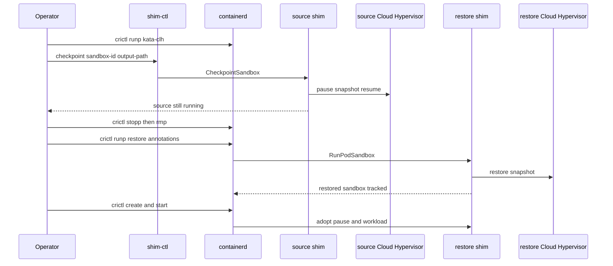

# How to build, install, and use Cloud Hypervisor checkpoint and restore

This guide covers a **same-node** verification path for checkpoint and restore
of a **running** Kata sandbox with Cloud Hypervisor and `runtime-rs`.

The control plane matches the QEMU path: `shim-ctl` sends `CheckpointSandbox`,
and a restore-annotated `crictl runp` converts create into incoming VMM
restore, agent reconnect, and task adoption. The storage plane does not.

=== "EROFS block devices"

    The current Cloud Hypervisor implementation checkpoints **raw virtio-blk**
    backing files: read-only EROFS lowers plus a writable ext4 upper. There is
    no `virtiofsd` on the container rootfs path. Verified with Cloud Hypervisor
    v53.0 and containerd v2.3.3.

=== "virtio-fs"

    An earlier path restores virtio-fs overlays, the same way QEMU does. It
    still works, but it requires `virtiofsd` v1.14.0 and reconstructs source
    share paths. Prefer EROFS block devices for new work.

The designs live in
[Cloud Hypervisor checkpoint and restore with EROFS](../design/cloud-hypervisor-erofs-checkpoint-restore.md)
and
[Cloud Hypervisor checkpoint and restore debugging](../design/cloud-hypervisor-checkpoint-restore-debugging.md).
The QEMU compile overlay is
[How to build, install, and use QEMU Pod checkpoint and restore](how-to-build-and-use-qemu-pod-checkpoint-restore.md).

!!! warning "Verification, not a Kubernetes API"
    This path does **not** wait for CRI `CheckpointPod` / KEP-5823. Same-node
    restore only; Pod IP and live TCP are not preserved. A sandbox that used
    virtio-fs at checkpoint time cannot be restored onto EROFS virtio-blk (or
    the reverse): Cloud Hypervisor restores PCI and virtio topology as-is.

!!! danger "Do not mix rootfs backends in one sandbox"
    Checkpoint preflight rejects a sandbox that has both virtio-fs and EROFS
    block rootfs containers. The pause container and every workload must use
    the same backend.

## Prerequisites

You need a host that can already run Kata with Cloud Hypervisor and
`runtime-rs`:

- hardware virtualization and `/dev/kvm` (see [Installation](../installation.md))
- `vhost_vsock` and `vhost_net` loaded
- containerd with CRI (v2.2 or newer; EROFS snapshotter needs v2.2+, the
  block path was verified on v2.3.3), plus `crictl`
- Cloud Hypervisor **v53.0** (`hypervisor.cloud_hypervisor.version` in
  `versions.yaml`)
- Rust matching `languages.rust.meta.newest-version` in `versions.yaml`
  (currently `1.96`)

=== "EROFS block devices"

    - Linux `erofs` module loaded
    - `erofs-utils` 1.8.2 or newer (`mkfs.erofs --version`)
    - containerd EROFS snapshotter and differ plugins in `ok` state
    - See [How to use EROFS snapshotter with Kata](how-to-use-erofs-snapshotter-with-kata.md)

=== "virtio-fs"

    - `virtiofsd` **v1.14.0** at the path the runtime actually launches.
      v1.13.1 deadlocks Cloud Hypervisor restore on vhost-user `REPLY_ACK`.

      ```bash title="$ check the launched virtiofsd"
      sudo /opt/kata/libexec/virtiofsd --version
      ```

A packaged Kata install under `/opt/kata` is a convenient base. Rebuild the
**agent**, **guest image**, **runtime-rs shim**, and `shim-ctl` from this tree.

!!! note "Guest agent must match the host shim"
    Restore calls guest `RebindSandbox`. Rebuild the guest image from this
    branch.

## Build

Work from the repository root. The agent and guest image are the same
artifacts used for QEMU checkpoint restore.

### 1. Build the guest agent

```bash title="$ build kata-agent"
make -C src/agent
```

### 2. Build a guest rootfs image that contains this agent

```bash title="$ create a local rootfs"
export distro="ubuntu"
export ROOTFS_DIR="$(realpath tools/osbuilder/rootfs-builder/rootfs)"
sudo rm -rf "${ROOTFS_DIR}"
pushd tools/osbuilder/rootfs-builder
script -fec 'sudo -E USE_DOCKER=true ./rootfs.sh "${distro}"'
popd
```

If `rootfs.sh` did not install the agent you just built, copy it in:

```bash title="$ install a custom agent into the rootfs"
sudo install -o root -g root -m 0550 -t "${ROOTFS_DIR}/usr/bin" \
  "src/agent/target/$(uname -m)-unknown-linux-musl/release/kata-agent"
sudo install -o root -g root -m 0440 src/agent/kata-agent.service \
  "${ROOTFS_DIR}/usr/lib/systemd/system/"
sudo install -o root -g root -m 0440 src/agent/kata-containers.target \
  "${ROOTFS_DIR}/usr/lib/systemd/system/"
```

```bash title="$ build the guest disk image"
pushd tools/osbuilder/image-builder
script -fec 'sudo -E USE_DOCKER=true ./image_builder.sh "${ROOTFS_DIR}"'
sudo install -o root -g root -m 0640 -D kata-containers.img \
  /opt/kata/share/kata-containers/kata-containers-clh-ckpt.img
popd
```

### 3. Build runtime-rs and shim-ctl

Cloud Hypervisor support is on by default in `runtime-rs`. Generate the CLH
configuration while you build:

```bash title="$ build the Cloud Hypervisor runtime-rs shim"
cd src/runtime-rs
make USE_BUILTIN_DB=false HYPERVISOR=clh-runtime-rs
```

`make` uses `--target $(uname -m)-unknown-linux-musl`. Confirm the binaries:

```bash title="$ locate the binaries"
triple="$(uname -m)-unknown-linux-musl"
ls ../../target/${triple}/release/containerd-shim-kata-v2 \
   ../../target/${triple}/release/shim-ctl
```

!!! note "Host-tuple cargo builds land at the repo root"
    A plain `cargo build --release -p runtime-rs` from `src/runtime-rs` still
    writes `target/release/` at the **repository root**, not
    `src/runtime-rs/target/release`. The Makefile path above is
    `target/<triple>/release/`.

```bash title="$ rebuild shim-ctl only"
cargo build -p runtime-rs --bin shim-ctl --release
```

## Install

```bash title="$ install runtime-rs for Cloud Hypervisor"
cd src/runtime-rs
sudo make install PREFIX=/opt/kata USE_BUILTIN_DB=false HYPERVISOR=clh-runtime-rs
sudo install -D ../../target/$(uname -m)-unknown-linux-musl/release/shim-ctl \
  /usr/local/bin/shim-ctl
```

Point the Cloud Hypervisor configuration at the rebuilt guest image. The
section name is `hypervisor.clh`:

```toml title="/opt/kata/share/defaults/kata-containers/runtime-rs/configuration-clh-runtime-rs.toml"
[hypervisor.clh]
image = "/opt/kata/share/kata-containers/kata-containers-clh-ckpt.img"
path = "/opt/kata/bin/cloud-hypervisor"
```

Confirm `path` is Cloud Hypervisor v53.0:

```bash title="$ check Cloud Hypervisor"
/opt/kata/bin/cloud-hypervisor --version
```

`/etc/kata-containers/configuration.toml` overrides the packaged file if you
prefer not to edit `/opt/kata`.

Restart containerd after replacing the shim:

```bash title="$ restart containerd"
sudo systemctl restart containerd
```

## Configure containerd

Allow Kata restore annotations. Use `sandboxer = 'podsandbox'` so CRI owns the
sandbox the same way the verified runs did.

=== "EROFS block devices"

    Enable the EROFS snapshotter and differ, and pin this runtime handler to
    `snapshotter = "erofs"` so the **pause** container and the workload both
    get block rootfs.

    ```toml title="/etc/containerd/config.toml"
    version = 3

    [plugins.'io.containerd.cri.v1.runtime'.containerd.runtimes.kata-clh]
      runtime_type = 'io.containerd.kata.v2'
      runtime_path = '/opt/kata/runtime-rs/bin/containerd-shim-kata-v2'
      privileged_without_host_devices = true
      sandboxer = 'podsandbox'
      snapshotter = 'erofs'
      pod_annotations = ['io.katacontainers.*']

      [plugins.'io.containerd.cri.v1.runtime'.containerd.runtimes.kata-clh.options]
        ConfigPath = '/opt/kata/share/defaults/kata-containers/runtime-rs/configuration-clh-runtime-rs.toml'

    [plugins.'io.containerd.differ.v1.erofs']
      mkfs_options = ["-T0", "--mkfs-time", "--sort=none"]
      enable_tar_index = false

    [plugins.'io.containerd.service.v1.diff-service']
      default = ['erofs', 'walking']

    [plugins.'io.containerd.snapshotter.v1.erofs']
      default_size = '6G'
      max_unmerged_layers = 0
    ```

    The plugin table names must be **closed** quotes. A header such as
    `[plugins.'io.containerd.differ.v1.erofs]` (missing the final `'`) makes
    containerd reject the file.

    After restart:

    ```bash title="$ confirm EROFS plugins"
    sudo ctr plugins ls | grep erofs
    ```

    Both `snapshotter` and `differ` must show `ok`.

    For a block-only guest you may set `shared_fs = "none"` in
    `configuration-clh-runtime-rs.toml`. Keep `virtio-fs` if you still need
    host-file mounts; do not put those extra mounts on the first verification
    Pod.

=== "virtio-fs"

    Do **not** set `snapshotter = "erofs"` on this handler. Overlay snapshots
    feed virtio-fs.

    ```toml title="/etc/containerd/config.toml"
    [plugins.'io.containerd.cri.v1.runtime'.containerd.runtimes.kata-clh]
      runtime_type = 'io.containerd.kata.v2'
      runtime_path = '/opt/kata/runtime-rs/bin/containerd-shim-kata-v2'
      privileged_without_host_devices = true
      sandboxer = 'podsandbox'
      pod_annotations = ['io.katacontainers.*']

      [plugins.'io.containerd.cri.v1.runtime'.containerd.runtimes.kata-clh.options]
        ConfigPath = '/opt/kata/share/defaults/kata-containers/runtime-rs/configuration-clh-runtime-rs.toml'
    ```

    On containerd 1.7.x the plugin key is `io.containerd.grpc.v1.cri`.

!!! danger "Missing pod_annotations"
    If `pod_annotations` does not include `io.katacontainers.*`, restore
    starts a **cold** VM. Fix containerd first.

## Use

Keep the container image on the node. virtio-fs restore still needs overlay
`lowerdir` paths in containerd snapshots. EROFS restore copies lowers into the
checkpoint, but do not garbage-collect the image until you are finished
testing.

Prepare a checkpoint directory on a real filesystem (ext4 or xfs):

```bash title="$ prepare checkpoint storage"
sudo mkdir -p /var/lib/kata/checkpoints/clh-demo
sudo chmod 0700 /var/lib/kata/checkpoints
```

A 256 MiB guest is enough for the counter workload and shortens snapshot time.
`default_memory` is already in `enable_annotations` for the generated CLH
config.

### 1. Start a stateful source pod

`source-pod.json`:

```json title="source-pod.json"
{
  "metadata": {
    "name": "clh-ckpt-src",
    "namespace": "default",
    "uid": "clh-ckpt-src",
    "attempt": 0
  },
  "annotations": {
    "io.katacontainers.config.hypervisor.default_memory": "256"
  },
  "linux": {}
}
```

`container.json` — a counter that writes `/counter`:

```json title="container.json"
{
  "metadata": {
    "name": "counter",
    "attempt": 0
  },
  "image": {
    "image": "docker.io/library/busybox:latest"
  },
  "command": [
    "sh",
    "-c",
    "i=0; while true; do i=$((i+1)); echo \"$i\" > /counter; sleep 1; done"
  ]
}
```

```bash title="$ run the source sandbox"
sudo crictl pull docker.io/library/busybox:latest
SRC_POD=$(sudo crictl runp --runtime kata-clh source-pod.json)
SRC_CTR=$(sudo crictl create "$SRC_POD" container.json source-pod.json)
sudo crictl start "$SRC_CTR"
sleep 5
sudo crictl exec "$SRC_CTR" cat /counter
```

=== "EROFS block devices"

    Confirm the source VM has **no** Cloud Hypervisor `fs` device for rootfs
    and that EROFS plus ext4 appear as disks. After checkpoint you can inspect
    `config.json` with:

    ```bash title="$ inspect Cloud Hypervisor disks"
    jq '{fs, disks: [.disks[] | {id, path, readonly}]}' \
      /var/lib/kata/checkpoints/clh-demo/config.json
    ```

=== "virtio-fs"

    The source uses the default virtio-fs share. Checkpoint records overlay
    `lowerdir` paths and copies `rw-diff` plus `share-passthrough/`.

Record the full source sandbox id. `shim-ctl` needs it; `crictl inspectp` shows
it.

### 2. Checkpoint with shim-ctl

```bash title="$ CheckpointSandbox via shim-ctl"
sudo shim-ctl checkpoint "$SRC_POD" /var/lib/kata/checkpoints/clh-demo
```

Optional arguments are CRI namespace (default `k8s.io`) and the shim ttrpc
address. If omitted, `shim-ctl` reads:

```text
/run/containerd/io.containerd.runtime.v2.task/<namespace>/<sandbox-id>/address
```

The RPC disconnects the agent, pauses Cloud Hypervisor, writes the bundle, then
**resumes** the source. The source counter may keep advancing after return.
Restored counters resume from **checkpoint time**, not from the source's later
value.

### 3. Remove the source sandbox

```bash title="$ tear down the source"
sudo crictl stopp "$SRC_POD"
sudo crictl rmp "$SRC_POD"
```

Reuse a CRI sandbox **name** only after the previous sandbox is fully gone, or
containerd reports the name as reserved. Use a new destination name (below).

### 4. Restore with a new CRI sandbox

`restore-pod.json`:

```json title="restore-pod.json"
{
  "metadata": {
    "name": "clh-ckpt-dst",
    "namespace": "default",
    "uid": "clh-ckpt-dst",
    "attempt": 0
  },
  "annotations": {
    "io.katacontainers.config.hypervisor.default_memory": "256",
    "io.katacontainers.vm.restore": "true",
    "io.katacontainers.vm.checkpoint_dir": "/var/lib/kata/checkpoints/clh-demo"
  },
  "linux": {}
}
```

```bash title="$ restore via annotated runp"
DST_POD=$(sudo crictl -t 120s runp --runtime kata-clh restore-pod.json)
DST_CTR=$(sudo crictl create "$DST_POD" container.json restore-pod.json)
sudo crictl start "$DST_CTR"
sudo crictl exec "$DST_CTR" cat /counter
sleep 2
sudo crictl exec "$DST_CTR" cat /counter
```

The second `/counter` value must be **larger** than the first and must not
restart from zero. `CreateContainer` / `StartContainer` adopt restored
processes.

A second restore from the same bundle must use another unique sandbox name.
Each restore gets a private writable upper.

### 5. What success looks like

- `shim-ctl checkpoint` prints `checkpoint saved to ...` and the source still
  runs
- destination is a new sandbox (new netns, TAP, vsock socket)
- `/counter` continues instead of resetting
- a second restore from the same directory also continues from checkpoint time



## Checkpoint bundle layout

=== "EROFS block devices"

    ```text
    /var/lib/kata/checkpoints/clh-demo/
    ├── metadata.json
    ├── config.json
    ├── state.json
    ├── memory-ranges
    └── containers/
        └── <old-container-id>/
            ├── lower-0.erofs
            └── upper.ext4
    ```

    `config.json`, `state.json`, and `memory-ranges` come from Cloud
    Hypervisor. Restore patches disk **paths** by disk **id** and clones each
    ext4 upper into the destination VM directory. Read-only EROFS files may be
    reused from the bundle after containment checks.

=== "virtio-fs"

    ```text
    /var/lib/kata/checkpoints/clh-demo/
    ├── metadata.json
    ├── config.json
    ├── state.json
    ├── memory-ranges
    ├── share-passthrough/
    └── containers/
        └── <old-container-id>/
            ├── rw-diff/
            └── restores/<new-sandbox-id>/
    ```

    Overlay `rw-diff` is cloned per restore. Restore also patches vsock and
    virtio-fs socket paths and passes TAP file descriptors into the Cloud
    Hypervisor restore API. Memory restore is on-demand (`userfaultfd`);
    `memory-ranges` is symlinked rather than copied again.

## Operational constraints

- Restore is **same node**.
- Ext4 checkpoint copies are crash-consistent, not application-consistent.
- Extra `hostPath` volumes, GPU/VFIO, confidential guests, and
  cross-Cloud-Hypervisor-version restore are out of scope.
- Independent hot-unplug of a restored container rootfs is not supported;
  tear down the whole sandbox.
- Checkpoint size tracks guest RAM plus (for EROFS) copied backing files.
  Watch disk space under `/var/lib/kata/checkpoints`.

## Troubleshooting

Work through
[Cloud Hypervisor checkpoint and restore debugging](../design/cloud-hypervisor-checkpoint-restore-debugging.md)
and the EROFS design's local-verification notes.

Typical traps:

- restore annotations never reached the shim
- `virtiofsd` older than v1.14.0 (virtio-fs path only)
- mixed virtio-fs and EROFS rootfs in one sandbox
- destination CRI name still reserved from a previous sandbox
- looking for cargo output under `src/runtime-rs/target/`

```bash title="$ inspect checkpoint storage"
df -h /var/lib/kata/checkpoints
du -sh /var/lib/kata/checkpoints/*
```
