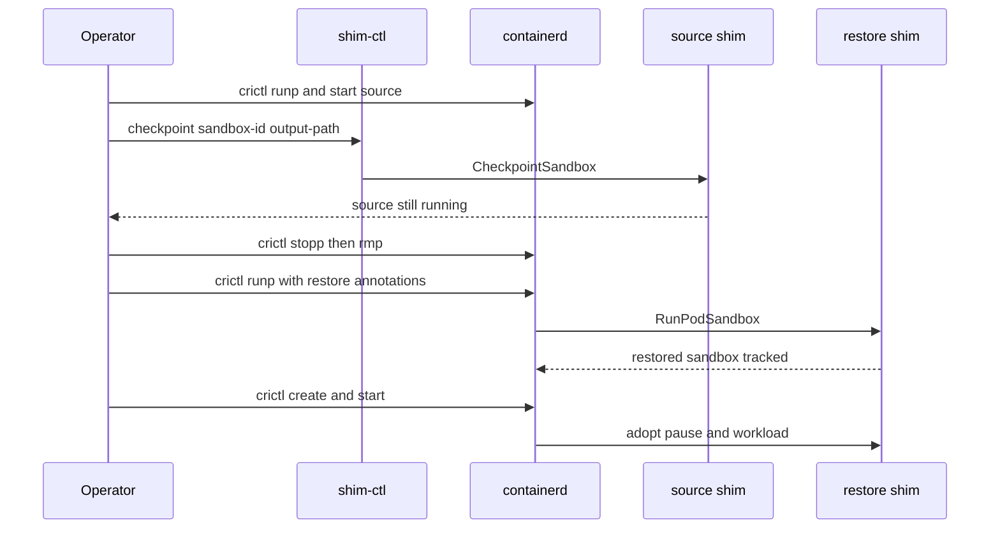

# How to build, install, and use QEMU Pod checkpoint and restore

This guide covers a **same-node** verification path for QEMU-level checkpoint
and restore of a **running** Kata sandbox with `runtime-rs`.

Checkpoint is driven by `shim-ctl` over the shim Sandbox API. Restore is a
normal `crictl runp` whose annotations convert create into incoming QEMU,
agent reconnect, and task adoption. containerd still owns the restored
sandbox.

The design and failure archive live in
[QEMU Pod checkpoint and restore](../design/qemu-pod-checkpoint-restore.md)
and
[QEMU Pod checkpoint and restore debugging](../design/qemu-pod-checkpoint-restore-debugging.md).
The Cloud Hypervisor counterpart is
[How to build, install, and use Cloud Hypervisor checkpoint and restore](how-to-build-and-use-cloud-hypervisor-checkpoint-restore.md).

!!! warning "Verification, not a Kubernetes API"
    This path does **not** wait for CRI `CheckpointPod` / KEP-5823. Do not use
    it as a production checkpoint product. Same-node restore only; Pod IP and
    live TCP are not preserved.

## Prerequisites

You need a host that can already run Kata with QEMU and `runtime-rs`:

- hardware virtualization and `/dev/kvm` (see [Installation](../installation.md))
- `vhost_vsock` and `vhost_net` loaded
- containerd with CRI, plus `crictl`
- QEMU with incoming migration (verified against QEMU 10.2.1)
- `virtiofsd`
- Rust matching `languages.rust.meta.newest-version` in `versions.yaml`
  (currently `1.96`)

A packaged Kata install under `/opt/kata` is a convenient base. This guide
rebuilds the **agent**, **guest image**, **runtime-rs shim**, and `shim-ctl`
from this tree and overlays them.

!!! note "Guest agent must match the host shim"
    Restore calls guest `RebindSandbox`. A stock guest image without that
    handler will migrate QEMU and then fail at agent rebind. Rebuild the
    guest image from this branch.

## Build

Work from the repository root.

### 1. Build the guest agent

```bash title="$ build kata-agent"
make -C src/agent
```

The binary lands at `target/<triple>/<profile>/kata-agent`. `rootfs.sh` below
can also compile the agent itself; building it first is useful when you want
to confirm the crate compiles before imaging.

### 2. Build a guest rootfs image that contains this agent

Use osbuilder so the image is produced from the current tree:

```bash title="$ create a local rootfs"
export distro="ubuntu"
export ROOTFS_DIR="$(realpath tools/osbuilder/rootfs-builder/rootfs)"
sudo rm -rf "${ROOTFS_DIR}"
pushd tools/osbuilder/rootfs-builder
script -fec 'sudo -E USE_DOCKER=true ./rootfs.sh "${distro}"'
popd
```

If `rootfs.sh` did not install the agent you just built, copy it in:

```bash title="$ install a custom agent into the rootfs"
sudo install -o root -g root -m 0550 -t "${ROOTFS_DIR}/usr/bin" \
  "src/agent/target/$(uname -m)-unknown-linux-musl/release/kata-agent"
sudo install -o root -g root -m 0440 src/agent/kata-agent.service \
  "${ROOTFS_DIR}/usr/lib/systemd/system/"
sudo install -o root -g root -m 0440 src/agent/kata-containers.target \
  "${ROOTFS_DIR}/usr/lib/systemd/system/"
```

Package the image:

```bash title="$ build the guest disk image"
pushd tools/osbuilder/image-builder
script -fec 'sudo -E USE_DOCKER=true ./image_builder.sh "${ROOTFS_DIR}"'
sudo install -o root -g root -m 0640 -D kata-containers.img \
  /opt/kata/share/kata-containers/kata-containers-qemu-ckpt.img
popd
```

Alternatively, from `tools/packaging/kata-deploy/local-build`:

```bash title="$ kata-deploy local rootfs tarball"
export USE_CACHE=no
make rootfs-image-tarball
```

See [Building and deploying local artifacts](how-to-build-and-deploy-local-artifacts.md)
for extracting that tarball onto a node.

### 3. Build runtime-rs and shim-ctl

```bash title="$ build the QEMU runtime-rs shim"
cd src/runtime-rs
make USE_BUILTIN_DB=false HYPERVISOR=qemu
```

`make` builds the `runtime-rs` package, which includes both
`containerd-shim-kata-v2` and `shim-ctl`. The default `utils.mk` triple is
`$(uname -m)-unknown-linux-musl` (`LIBC` defaults to `musl`). Confirm they
exist:

```bash title="$ locate the binaries"
triple="$(uname -m)-unknown-linux-musl"
ls ../../target/${triple}/release/containerd-shim-kata-v2 \
   ../../target/${triple}/release/shim-ctl
```

If you only need `shim-ctl` after the shim is already built:

```bash title="$ rebuild shim-ctl only"
cargo build -p runtime-rs --bin shim-ctl --release
```

## Install

### Overlay the shim on a Kata install

The examples assume a kata-deploy layout. Adjust `PREFIX` if you install under
`/usr/local`.

```bash title="$ install runtime-rs"
cd src/runtime-rs
sudo make install PREFIX=/opt/kata USE_BUILTIN_DB=false HYPERVISOR=qemu
sudo install -D ../../target/$(uname -m)-unknown-linux-musl/release/shim-ctl \
  /usr/local/bin/shim-ctl
```

Point the QEMU `runtime-rs` configuration at the rebuilt guest image:

```toml title="/opt/kata/share/defaults/kata-containers/runtime-rs/configuration-qemu-runtime-rs.toml"
[hypervisor.qemu]
image = "/opt/kata/share/kata-containers/kata-containers-qemu-ckpt.img"
```

`/etc/kata-containers/configuration.toml` overrides the packaged file if you
prefer not to edit `/opt/kata`.

Restart containerd after replacing the shim:

```bash title="$ restart containerd"
sudo systemctl restart containerd
```

### Configure containerd

The restore annotations must reach the Kata shim. Allow the Kata annotation
namespace on the `runtime-rs` QEMU runtime:

```toml title="/etc/containerd/config.toml"
[plugins."io.containerd.cri.v1.runtime".containerd.runtimes.kata-qemu-runtime-rs]
  runtime_type = "io.containerd.kata-qemu-runtime-rs.v2"
  runtime_path = "/opt/kata/runtime-rs/bin/containerd-shim-kata-v2"
  privileged_without_host_devices = true
  pod_annotations = ["io.katacontainers.*"]

[plugins."io.containerd.cri.v1.runtime".containerd.runtimes.kata-qemu-runtime-rs.options]
  ConfigPath = "/opt/kata/share/defaults/kata-containers/runtime-rs/configuration-qemu-runtime-rs.toml"
```

On containerd 1.7.x the plugin key is `io.containerd.grpc.v1.cri` instead of
`io.containerd.cri.v1.runtime`.

!!! danger "Missing pod_annotations"
    If `pod_annotations` does not include `io.katacontainers.*`, restore
    starts a **cold** VM. The QEMU command line will lack `-incoming defer`.
    Fix containerd first; do not debug migration until the annotation is in
    the shim `SandboxConfig`.

## Use

The first verification is a pause sandbox plus one workload whose in-memory
or filesystem counter must survive restore. Keep the container **image** on
the node; overlay `lowerdir` paths are containerd image snapshots.

Prepare a checkpoint directory on a real filesystem (ext4 or xfs), not a
tiny tmpfs:

```bash title="$ prepare checkpoint storage"
sudo mkdir -p /var/lib/kata/checkpoints/demo
sudo chmod 0700 /var/lib/kata/checkpoints
```

### 1. Start a stateful source pod

`sandbox.json`:

```json title="sandbox.json"
{
  "metadata": {
    "name": "ckpt-src",
    "uid": "ckpt-src",
    "namespace": "k8s.io"
  },
  "hostname": "ckpt-src",
  "linux": {}
}
```

`container.json` — a counter that writes `/tmp/counter`:

```json title="container.json"
{
  "metadata": {
    "name": "counter",
    "namespace": "k8s.io"
  },
  "image": {
    "image": "docker.io/library/busybox:latest"
  },
  "command": [
    "sh",
    "-c",
    "i=0; while true; do echo $i > /tmp/counter; i=$((i+1)); sleep 1; done"
  ]
}
```

```bash title="$ run the source sandbox"
sudo crictl pull docker.io/library/busybox:latest
SRC_POD=$(sudo crictl runp -r kata-qemu-runtime-rs sandbox.json)
SRC_CTR=$(sudo crictl create "$SRC_POD" container.json sandbox.json)
sudo crictl start "$SRC_CTR"
sleep 5
sudo crictl exec "$SRC_CTR" cat /tmp/counter
```

Record the source sandbox id (`SRC_POD`). `shim-ctl` needs the full id, which
`crictl pods -q` or `crictl inspectp` can show.

### 2. Checkpoint with shim-ctl

```bash title="$ CheckpointSandbox via shim-ctl"
sudo shim-ctl checkpoint "$SRC_POD" /var/lib/kata/checkpoints/demo
```

Optional arguments are CRI namespace (default `k8s.io`) and the shim ttrpc
address. If omitted, `shim-ctl` reads:

```text
/run/containerd/io.containerd.runtime.v2.task/<namespace>/<sandbox-id>/address
```

The RPC pauses QEMU, writes the bundle, then **resumes** the source. The
source is still running after a successful checkpoint.

Confirm the bundle:

```bash title="$ inspect the checkpoint bundle"
ls -l /var/lib/kata/checkpoints/demo
# memory  device-state  vm.json  metadata.json  share-passthrough  containers
```

### 3. Remove the source sandbox

Stop, then remove. Do **not** remove the image and do **not** run snapshot GC
in between.

```bash title="$ tear down the source"
sudo crictl stopp "$SRC_POD"
sudo crictl rmp "$SRC_POD"
```

`stopp` kills QEMU and frees the vsock CID and the `memory` file mapping.
`rmp` deletes the source share directory and the live overlay upper. Restore
uses `rw-diff` from the bundle and the still-present image `lowerdir` paths.

!!! warning "Source and destination cannot share the vsock CID"
    Restore reuses the saved vsock CID. If the source VM is still up,
    destination bind of `/dev/vhost-vsock` fails.

### 4. Restore with a new CRI sandbox

`restore-sandbox.json` is a **new** pod. Only the restore annotations select
the create-conversion path. Keep the workload container **name** (`counter`)
so adoption can match it.

```json title="restore-sandbox.json"
{
  "metadata": {
    "name": "ckpt-dst",
    "uid": "ckpt-dst",
    "namespace": "k8s.io"
  },
  "hostname": "ckpt-dst",
  "annotations": {
    "io.katacontainers.vm.restore": "true",
    "io.katacontainers.vm.checkpoint_dir": "/var/lib/kata/checkpoints/demo"
  },
  "linux": {}
}
```

```bash title="$ restore via annotated runp"
DST_POD=$(sudo crictl runp -r kata-qemu-runtime-rs restore-sandbox.json)
DST_CTR=$(sudo crictl create "$DST_POD" container.json restore-sandbox.json)
sudo crictl start "$DST_CTR"
sudo crictl exec "$DST_CTR" cat /tmp/counter
```

`CreateContainer` / `StartContainer` **adopt** the restored guest processes.
They must not exec a new init. If `/tmp/counter` resets to `0`, restore fell
back to a cold create.

A second restore from the same bundle is supported: each restore clones
`rw-diff` under `containers/<old-id>/restores/<new-sandbox-id>/` so the
canonical checkpoint is not mutated.

### 5. What success looks like

- `shim-ctl checkpoint` returns and prints `checkpoint saved to ...`
- the bundle contains `memory`, `device-state`, `vm.json`, `metadata.json`,
  `share-passthrough/`, and per-container `rw-diff`
- destination QEMU is started with `-S -incoming defer`
- `crictl exec` shows the original process and a **non-reset** counter
- guest `ps` (via `crictl exec`) still shows the workload, not a new shell
  started at restore time



## Checkpoint bundle layout

```text
/var/lib/kata/checkpoints/demo/
├── memory
├── device-state
├── vm.json
├── metadata.json
├── share-passthrough/
└── containers/
    └── <old-container-id>/
        ├── rw-diff/
        └── restores/
            └── <new-sandbox-id>/
                ├── rw-diff/
                ├── rw-work/
                └── merged/
```

memory
:   Private file-backed guest RAM. Restore maps a copy; do not leave the
    source QEMU holding this file.

device-state
:   CPU and device migration stream (`x-ignore-shared` keeps RAM out of it).

vm.json
:   Source vsock CID and guest NIC MAC addresses.

metadata.json
:   Old sandbox/container ids, OCI specs, overlay `lowerdir` paths.

share-passthrough/
:   Host files for hostname, hosts, and `resolv.conf` under their original
    virtio-fs names.

rw-diff/
:   Copied overlay upper. Restore clones it; never mount the canonical copy
    as the live upper.

## Operational constraints

- Restore is **same node**. Overlay `lowerdir` paths must still exist in containerd
  snapshots.
- Default shared filesystem is virtio-fs. Extra host volumes, GPU/VFIO, and
  confidential guests are out of scope.
- Checkpoint size is roughly guest RAM. Watch disk space under
  `/var/lib/kata/checkpoints`.
- Delete unused checkpoint directories yourself. The runtime does not implement
  a retention policy.

## Troubleshooting

Work through the diagnostic order in
[QEMU Pod checkpoint and restore debugging](../design/qemu-pod-checkpoint-restore-debugging.md).
The short version:

1. Restore annotations present in the shim config.
2. Destination QEMU has `-incoming defer`.
3. Bundle files exist and the source VM is gone.
4. Then QMP / virtiofsd / vsock / `RebindSandbox` / adopt.

```bash title="$ inspect checkpoint storage"
df -h /var/lib/kata/checkpoints
du -sh /var/lib/kata/checkpoints/*
```
